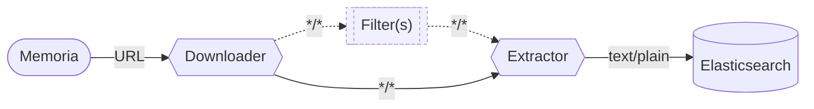
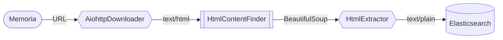

Plugin Development
==================

<!-- cSpell:ignore importlib pyproject aiohttp dataclass urllib -->
<!-- cSpell:words Downloaders -->

**Index**

* 🌐 [Web Content Retrieval and Processing](#web-content-retrieval-and-processing)
  * 💾 [§ Downloaders](#downloaders)
  * ⚗️ [§ Filters](#filters)
  * 🔤 [§ Extractors](#extractors)

A plugin is any Python class implementing one or more [plugin types](#plugin-functionalities) that is exported as an
[importlib entrypoint][ep] in the `memoria` group.

<details><summary>Example entrypoint configuration</summary>

The built-in plugins in Memoria are exported in [`pyproject.toml`](../pyproject.toml) like so:

```toml
[project.entry-points.memoria]
AiohttpDownloader = "memoria.plugins.builtin.aiohttp_downloader:AiohttpDownloader"
HtmlContentFinder = "memoria.plugins.builtin.html_content_finder:HtmlContentFinder"
HtmlExtractor = "memoria.plugins.builtin.html_extractor:HtmlExtractor"
```

</details>

Plugin classes must implement one or more specific plugin roles by inheriting [Downloader][dl], [Filter][fl], or
[Extractor][ex].

Plugin Functionalities
----------------------

> [!TIP]
> Memoria will activate each plugin configured for use<sup>[§](../README.md#configuration)</sup> as an [async context manager][acm] before being used. This allows for any setup or tear down logic to run. 
> 
> For example, the built-in [`AiohttpDownloader`][ahd] plugin uses this functionality to setup and tear down an `aiohttp.ClientSession`.

### Web Content Retrieval and Processing

Web content is downloaded by a plugin stack consisting of a Downloader, zero or more Filters, and an Extractor.



These types of plugins will produce a [`Result`][pb] dataclass that contains the current state of the content, its
content-type, and any metadata associated. Results can also include the unmodified previous Result (if the content has
been changed).

Memoria will ensure that the configured plugin stack has appropriate content-types at each stage to ensure that content
can flow from one end of the stack to the other.

For example, here's how the built in plugins in Memoria exchange data.



Each phase of plugins returns a `Result` dataclass, which (among other things) contains the content and content-encoding
of the plugin's output, any metadata the plugins have accumulated, the URL that was accessed and the URL that was
requested (which may differ because of redirects), and a copy of the input from the previous plugin.

#### Downloaders

Downloaders are used to retrieve the content of a URL from the internet. The most basic downloader would use `urllib` to
get raw `text/html`. Downloaders define a class attribute, `content_types`, that defines the format(s) it can provide
content in to the next plugin in the stack.

When Memoria wants to begin processing a URL it calls the `download` function on the configured Downloader with the URL
and the intersection of the provided content-types and the `accept`-ed content-types of the next plugin in the stack.
It's up to the Downloader to the produce a `Result` containing content in one of these requested formats.

#### Filters

Filters are optional plugins used to transform content in some way before passing it to the next plugin in the stack.
Transformation can mean changing the content, or even converting it into a different content-type. Filter plugins define
both an `accept`-ed set of content-types as input and a set of `content_types` it can provide to the next plugin in the
stack.

When Memoria is ready to run a Filter on some content it will call the `transform` function of the Filter with the
`Result` output by the previous plugin and the intersection of the provided content-types and the `accept`-ed
content-types of the next plugin in the stack. It's up to the Filter to verify that the incoming `Result` is of an
accepted content-type and to produce a `Result` containing content in one of these requested formats.

#### Extractors

Extractors are the last plugin in a stack, and are responsible for extracting plain text from the input content, which
is then stored in Elasticsearch by Memoria for indexing and searching. Extractor plugins define an `accept`-ed set of
content-types as input from the previous plugin in the stack.

When Memoria is ready to perform extraction on some content it will call the `extract` function of the Extractor with
the `Result` of the previous plugin. It's up to the Extractor to verify that the incoming `Result` is of an accepted
content-type.

[pb]: ../src/memoria/plugins/base.py
[ep]: https://packaging.python.org/en/latest/specifications/entry-points/
[acm]: https://docs.python.org/3/library/contextlib.html#contextlib.AbstractAsyncContextManager
[ahd]: ../src/memoria/plugins/builtin/aiohttp_downloader.py
[dl]: ../src/memoria/plugins/downloader.py
[fl]: ../src/memoria/plugins/filter.py
[ex]: ../src/memoria/plugins/extractor.py
